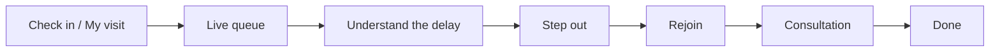

# ByteStorm-WaitEase

<p align="center">
  
</p>

<p align="center">
  <a href="https://img.shields.io/badge/PixelRush-2026-1F6F64?style=flat-square"></a>
  <a href="https://img.shields.io/badge/CodingGita-Case%20Study%2005-C46B52?style=flat-square"></a>
  <a href="https://img.shields.io/badge/Format-Figma%20%2B%20HTML%2FCSS-2A3030?style=flat-square"></a>
  <a href="https://img.shields.io/badge/Dates-5%E2%80%936%20Oct%202026-E8D5C8?style=flat-square&labelColor=F7F1EA"></a>
</p>

<h1 align="center">WaitEase</h1>

<p align="center">
  Patient waiting, made transparent.<br />
  PixelRush 2026 · CodingGita · Case Study 05, CalmWait
</p>

WaitEase is a patient waiting experience for hospitals, clinics, and diagnostic centres. A queue token tells someone where they stand. It does not tell them how long the wait may last, why it slipped, whether the doctor is free, or if they can step out and still keep their place. WaitEase covers that whole visit, from arrival to “you are done.”

The interface uses a **medical skin**: warm ivory and blush, like calm skin under clinic light, with sage mist, a teal pulse, and a living ECG. On GitHub the motion is the looping banner and vitals strip below. Stylesheets do not run inside a README, so the animation is drawn into those images.

<p align="center">
  
</p>

## The problem

Patients sit for a long time without knowing:

- how many people are ahead
- why the delay happened
- whether their doctor is available, in consultation, or on a break
- whether they can leave for a few minutes
- when they should come back

Uncertainty is what makes the wait feel longer. A single number on a screen does not fix that.

WaitEase turns the waiting room into a journey people can follow:

**Checking in → Viewing the queue → Understanding delays → Stepping out → Returning for consultation**

## What a patient and the desk can do

| Need | What WaitEase shows |
| --- | --- |
| Check in and see the live queue | Who they are seeing, where, their token, and what happens next |
| Estimate the wait honestly | A time **range**, plus how many people are ahead |
| Trust the reason | Doctor status, and a plain-language explanation when something slips |
| Step out without losing the place | Leave request, return-by time, hold period, rejoin, and what “late” means |
| Stay informed away from the chair | “Your turn is near”, “Return now”, delay and availability updates, and a history |
| See the visit, not only the queue | Checked in, vitals, waiting, consultation, tests, done |
| Run the room | Reception queue, step-outs, priority cases, doctor status, delay messages |
| Learn where time goes | Wait by hour and doctor, delay causes, no-shows, step-outs, peak and quiet hours |

The sample visit used across the skin is **Token A-24**, **Dr. Mehta**, **General Medicine**.

## Journey



Priority cases stay visible. The copy says why someone moved ahead, instead of quietly rewriting the line.

## Seven screens

All seven exist in the Figma file for **laptop, tablet, and mobile**, and they are wired as one prototype. The HTML and CSS build follows that same design.

### 01 · Check-in / My visit

The front door of the visit. At a glance: clinician and room, queue number, current status, and the next thing that will happen. Built for a booked patient and a walk-in.

### 02 · Live queue status

The full picture of the wait.

- People ahead
- Estimated wait as a range
- Doctor status: available, in consultation, or on a break
- A delay explanation in ordinary language
- Priority called out in the open

### 03 · Step out and rejoin

Leave the room and keep the place.

- Temporary leave request
- Return-by time and how long the hold lasts
- The path back into the queue
- What happens if the patient is late

### 04 · Notifications

Updates that still make sense in a corridor or a canteen.

- “Your turn is near” and “Return now”
- Delay and doctor-availability messages
- Wording that keeps the uncertainty visible
- A history the patient can scroll back through

### 05 · Appointment progress

The visit as a path: **Checked in → Vitals → Waiting → Consultation → Tests → Done**. The current step is marked, and the next step says what to expect there.

### 06 · Reception dashboard

The desk’s view of the same room.

- Live queue, including people who have stepped out
- Controls for doctor status
- Flag and manage priority cases
- Send a delay update to everyone waiting

### 07 · Patient flow analytics

Where the clinic actually loses time.

- Average wait by hour and by doctor
- Main causes of delay
- No-shows and step-outs
- Peak hours and quiet hours

<p align="center">
  
</p>

## Saying the quiet part clearly

The design test in this brief is how to talk about an uncertain wait without inventing a precise minute. WaitEase follows four rules:

1. **Ranges, not a fake clock.** “About 18–25 min” can be true. “Ready at 2:41” usually cannot.
2. **Status before spin.** Available, in consultation, and on a break are different facts, and the screen says which one it is.
3. **A reason, in plain language.** “Dr. Mehta is with a patient who needed a longer consult” beats a silent timer.
4. **Priority is explained.** Someone moving ahead is a clinical decision the queue is allowed to see.

## Medical skin

The animated background is a calm clinical skin, not a dark dashboard and not a cartoon hospital. Ivory and blush shift slowly, like light on skin. Sage sits underneath. Teal is the only “instrument” color: the cross, the pulse rings, and the ECG.

| Token | Hex | Use |
| --- | --- | --- |
| Ivory | `#F7F1EA` | Page ground |
| Blush | `#ECCDBE` | Warm skin highlight |
| Sage | `#D2E2DA` | Secondary wash |
| Mist | `#E4ECE9` | Quiet surfaces |
| Teal | `#1F6F64` | Pulse, links, current step |
| Deep teal | `#164A44` | Supporting text |
| Ink | `#2A3030` | Headlines |
| Coral | `#C46B52` | Wait range and gentle alerts |

Typography in the banner is **Noto Serif** for the name and **Inter** for everything else. Rebuild the GIFs after a palette change:

```bash
python3 WaitEase/scripts/build_readme_assets.py
```

## Figma, then code

PixelRush is design first. The Figma file is the blueprint. The prototype is the visit. HTML and CSS are that same visit, built.

### Design · laptop, tablet, mobile

Each of the 7 screens is laid out three times. The tablet and phone versions are redesigned for the width: navigation, hierarchy, spacing, type, cards, buttons, forms, imagery, lists, charts, and how dense the screen is allowed to be. They are the same product, adapted.

The three layouts stay **clear, usable, and consistent**.

### Prototype

The prototype is one connected path, not a pile of frames:

`Check-in` → `Live queue` → `Step out and rejoin` → `Notifications` → `Appointment progress` → `Reception dashboard` → `Patient flow analytics`

An evaluator can click through the waiting room from arrival to the end of the visit.

### HTML and CSS

The coded pages follow the Figma file in layout, type, color, spacing, buttons, cards, imagery, hierarchy, and content structure. Responsive CSS for three breakpoints is **not** required in this round. Faithfulness to the design is the requirement.

```text
Figma        design · responsive layouts · prototype
HTML / CSS   structure · styling · the same experience
```

## What the round is scoring

| Lens | What “good” looks like here |
| --- | --- |
| Problem understanding | Waiting feels worse when it is uncertain. Patients and staff get transparency without a false promise. |
| User experience | Check in, wait, step out, return, and consult are obvious. |
| Visual design | Hierarchy, type, spacing, composition, consistency, readability, components. |
| Responsive thinking | Laptop, tablet, and mobile in Figma, each decided on purpose. |
| Prototyping | One walkable journey. |
| Frontend | HTML and CSS that match the frames. |
| Design-to-code consistency | The build is recognizably the file you designed. |

## Submission checklist

**Figma**

- [ ] All 7 screens
- [ ] Laptop, tablet, and mobile
- [ ] Layouts that adapt, rather than a scaled-down desktop
- [ ] A working prototype of the full flow

**HTML / CSS**

- [ ] Pages structured in HTML
- [ ] Styling in CSS
- [ ] Built from the Figma file
- [ ] Same visual system as the design

Responsive HTML and CSS are not required.

## Folder

Everything for this README lives in **`WaitEase/`**.

```text
WaitEase/
  README.md                                this page
  assets/waitease-banner.gif               animated medical skin, header
  assets/waitease-vitals.gif               looping ECG strip
  assets/waitease-mark.png                 teal cross mark
  scripts/build_readme_assets.py           rebuilds the GIFs and the mark
  brief/PixelRush-PS-05-CalmWait.pdf       PixelRush case study 05
```

Pillow is the only dependency for the art. Run it from the repository root:

```bash
pip install pillow
python3 WaitEase/scripts/build_readme_assets.py
```

## Golden rule

Design it in Figma. Make that design responsive. Then build the same experience.

The Figma file is the blueprint. The prototype is the visit a patient actually takes. The HTML and CSS prove the design can stand up as an interface.

<p align="center">
  
</p>

<p align="center">
  <b>WaitEase</b><br />
  PixelRush · First, design. Then, build.<br />
  5–6 October 2026 · CodingGita UI/UX + Frontend Hackathon
</p>